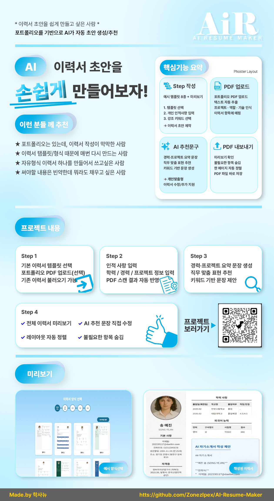
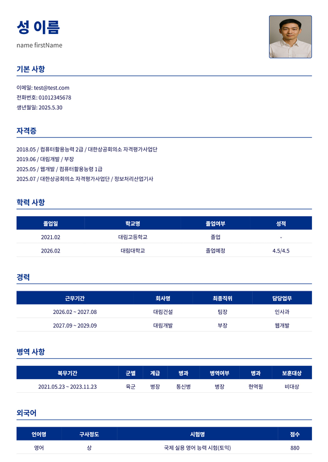
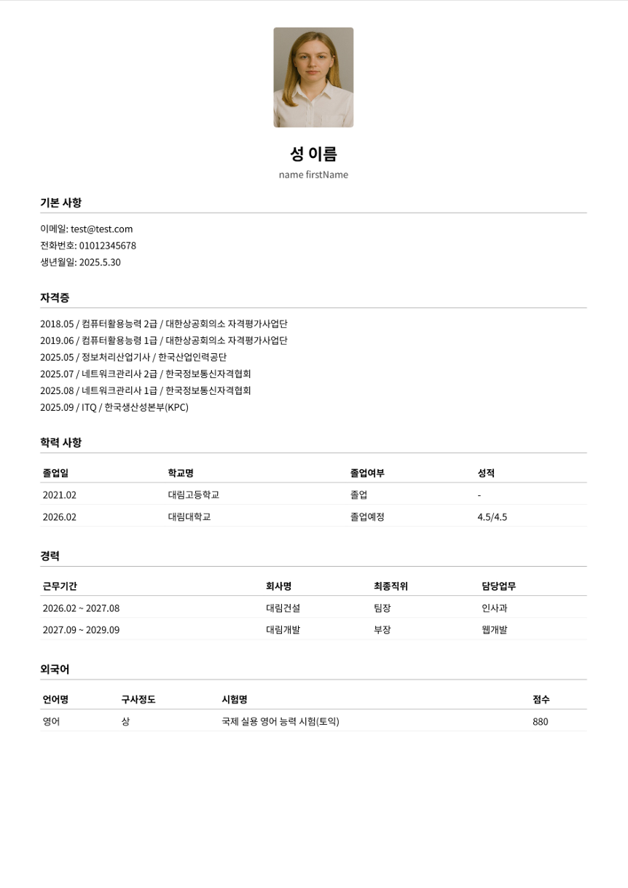
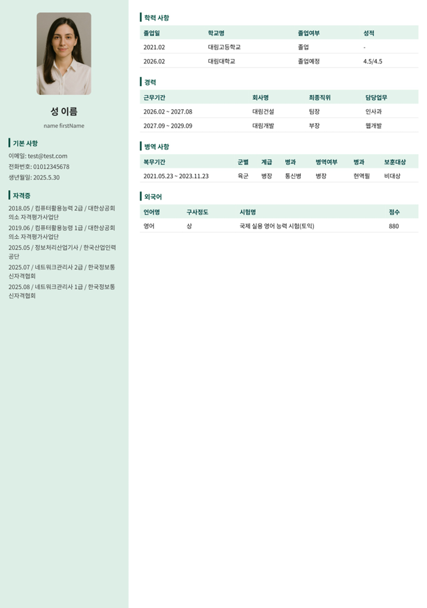
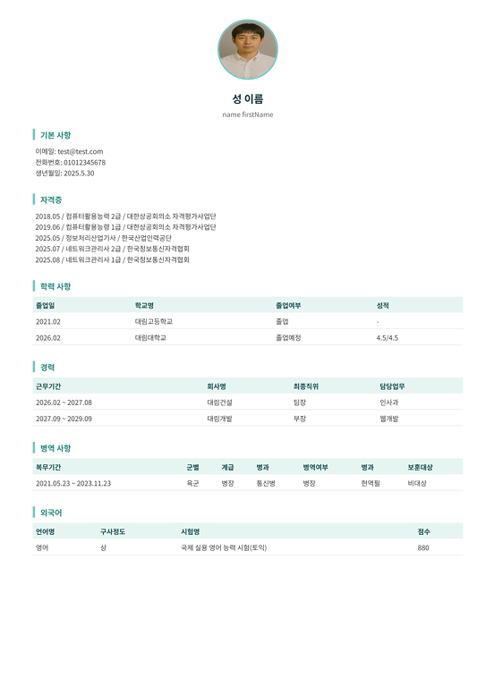
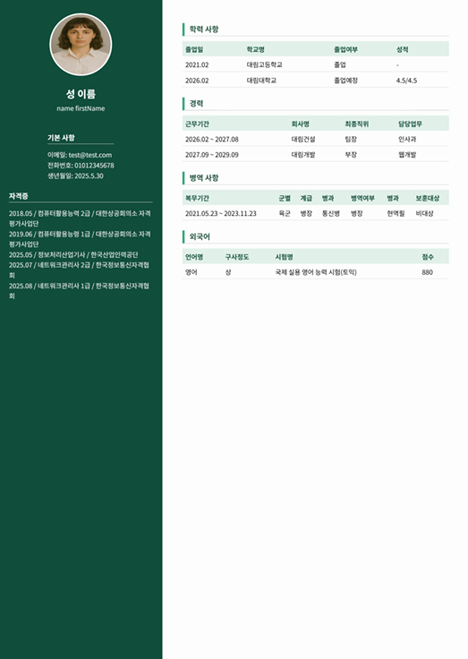
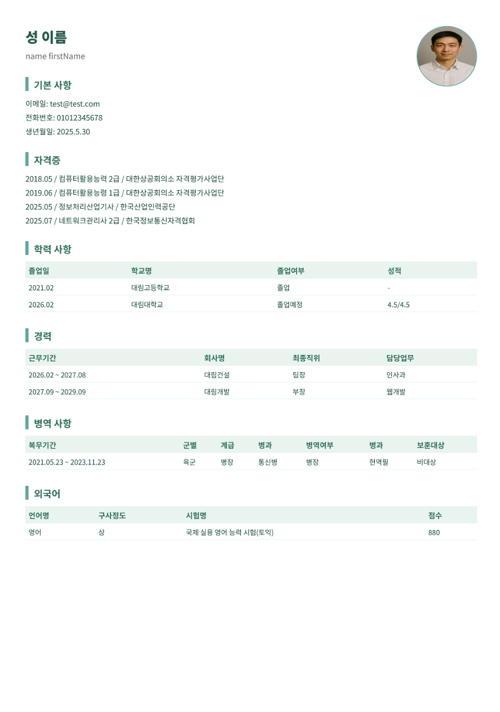
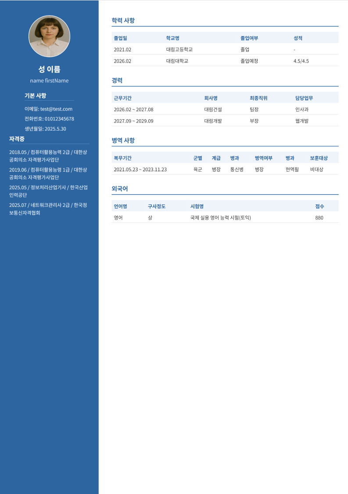

<div align="center">


<!-- ✅ 포스터 -->

<br /><br />

<br /><br />

<br />
<sub><b>AiR · AI Resume Maker</b></sub>

<br /><br />


<br/>


<br /><br />

<b>Step 기반 입력 → 미리보기 → PDF 저장까지</b><br/>
<b>이력서 작성 플로우를 웹으로 구현한 프로젝트</b>

<br/><br/>

<a href="./프로젝트_소개용.pdf"><b>📄 프로젝트 소개서(PDF)</b></a>
&nbsp;&nbsp;•&nbsp;&nbsp;
<a href="./소개영상.mp4"><b>🎬 소개영상(MP4)</b></a>

</div>

---

## 👀 목차
1. [📚 프로젝트 개요](#-프로젝트-개요)
2. [🎯 서비스 목표](#-서비스-목표)
3. [✨ 주요 기능](#-주요-기능)
4. [🧭 사용자 플로우](#-사용자-플로우)
5. [🖼️ 템플릿 미리보기](#️-템플릿-미리보기)
6. [🧱 프로젝트 구조](#-프로젝트-구조)
7. [🔌 API 연동](#-api-연동)
8. [🚀 실행 방법](#-실행-방법)
9. [🗺️ 라우팅](#️-라우팅)
10. [🧩 참고 자료](#-참고-자료)

---

## 📚 프로젝트 개요
**AI Resume Maker(AiR)** 는 사용자가 입력한 정보를 **Step 기반 UI**로 정리하고,  
미리보기 화면을 통해 확인한 뒤 **최종 이력서를 PDF로 저장**할 수 있도록 돕는 웹 프로젝트입니다.

---

## 🎯 서비스 목표
- **이력서 작성 부담을 단계형 입력으로 분해**해 UX 난이도를 낮춤
- 작성 결과를 **미리보기 기반으로 확인/수정** 가능하게 구성
- 리뷰/관리자 화면 등 **서비스 형태의 구조**를 프론트엔드 단에서 구현

---

## ✨ 주요 기능

### 1) Step 1~5 입력 플로우
- Step1~Step5로 개인정보/경력/학력/스킬 등 입력을 분산
- `App.js`에서 `formData`를 공통 상태로 관리하여 Step 간 데이터 공유

### 2) 템플릿 기반 미리보기
- 여러 템플릿을 선택해 이력서 UI를 미리보기 형태로 확인
- `public/resumePreview/*.css`를 통해 템플릿 스타일 분리

### 3) PDF 저장(Export)
- 미리보기 화면을 PDF로 저장하는 흐름 구성  
  (프론트에서는 `html2pdf.js` 기반 내보내기 흐름을 사용)

### 4) 인증/권한(관리자 UI 포함)
- 로그인 시 토큰을 저장하고, 요청 시 `Authorization: Bearer <token>` 자동 주입
- `/admin` 라우팅 및 하위 대시보드/유저/리뷰 화면 제공

### 5) 리뷰(커뮤니티)
- 리뷰 목록/작성/수정/삭제
- 좋아요/좋아요 취소

> 참고: 관리자 **유저/통계** 일부는 프론트 테스트 데이터 기반 영역이 포함될 수 있습니다.

---

## 🧭 사용자 플로우
1. 메인 진입  
2. 로그인/회원가입  
3. Step 1~5 입력으로 이력서 데이터 구성  
4. 템플릿 선택 후 미리보기 확인  
5. 최종 PDF로 저장  
6. 리뷰 작성/조회(선택)  
7. 관리자 화면 접근(권한 보유 시)

---

## 🖼️ 템플릿 미리보기
<div align="center">

<table>
  <tr>
    <td align="center"><br/><sub>Template 01</sub></td>
    <td align="center"><br/><sub>Template 02</sub></td>
    <td align="center"><br/><sub>Template 03</sub></td>
    <td align="center"><br/><sub>Template 04</sub></td>
  </tr>
  <tr>
    <td align="center"><br/><sub>Template 05</sub></td>
    <td align="center"><br/><sub>Template 06</sub></td>
    <td align="center"><br/><sub>Template 07</sub></td>
    <td align="center"><br/><sub>Template 08</sub></td>
  </tr>
</table>

</div>

---

## 🧱 프로젝트 구조
```txt
AI-Resume-Maker
├─ Team_project/
├─ public/
│  └─ resumePreview/          # 템플릿 관련 CSS
├─ src/
│  ├─ pages/                  # 화면(메인/로그인/스텝/리뷰 등)
│  ├─ adminPages/             # 관리자 화면(대시보드/유저/리뷰)
│  ├─ components/             # 공용 UI(Header/Footer/사이드바 등)
│  ├─ api/                    # axios 설정 + API 모듈
│  ├─ contexts/               # 인증/전역 상태
│  ├─ loadings/               # 파일 스캔/AI 생성 로딩 UI
│  ├─ utils/                  # 유틸리티
│  ├─ errorPages/             # 에러 페이지
│  ├─ App.js                  # 라우팅/공유 상태(formData)
│  └─ index.js
├─ .env
├─ AIR로고.png
├─ AIR포스터.png
├─ README.md
├─ package.json
├─ package-lock.json
├─ 소개영상.mp4
└─ 프로젝트_소개용.pdf
```

---

## 🔌 API 연동

### 공통 axios 설정
`src/api/axios.js`

- baseURL: `http://sarm-server.duckdns.org:8888`
- token: `localStorage.getItem("token")`
- 요청 헤더에 `Authorization: Bearer <token>` 자동 주입

```js
// src/api/axios.js
import axios from "axios";

const api = axios.create({
  baseURL: "http://sarm-server.duckdns.org:8888",
  // baseURL: "http://localhost:8888",
  withCredentials: true,
  headers: { "Content-Type": "application/json" },
});

api.interceptors.request.use(
  (config) => {
    const token = localStorage.getItem("token");
    if (token) {
      config.headers.Authorization = `Bearer ${token}`;
    }
    return config;
  },
  (error) => Promise.reject(error)
);

export default api;
```

### 주요 엔드포인트(프론트 코드 기준)

#### Auth / User
- `POST /api/auth/login` (로그인, 토큰 발급)
- `POST /api/auth/logout`
- `GET  /api/auth/check` (관리자 여부 확인)
- `GET  /api/data` (토큰 기반 사용자 정보)
- `POST /api/user/register` (회원가입)

#### Reviews
- `GET  /api/reviews/all`
- `GET  /api/reviews/my`
- `POST /api/reviews/submit`
- `PUT  /api/reviews/edit/:id`
- `DELETE /api/reviews/delete/:id`
- `POST /api/reviews/like/:reviewId`
- `DELETE /api/reviews/like/:reviewId`

> 서버 주소가 다르면 `src/api/axios.js`의 `baseURL`을 변경하세요.

---

## 🚀 실행 방법
```bash
git clone https://github.com/alstlr0307/AI-Resume_Maker.git
cd AI-Resume_Maker
npm install
npm start
```

- 기본 주소: `http://localhost:3000`

### 환경변수(선택)
`.env`
```env
REACT_APP_SERVER_URL=http://sarm-server.duckdns.org:8888/
```

> 현재 axios baseURL은 `src/api/axios.js`에 하드코딩되어 있어 `.env`를 사용하려면 코드 치환이 필요합니다.

---

## 🗺️ 라우팅
- `/` 메인
- `/login`, `/signup`
- `/mypage`, `/profilepage`
- `/step1page` ~ `/step5page`
- `/scan-pdf`, `/loading`
- `/review`, `/review/write`
- `/admin` (하위: `dashboard`, `users`, `reviews`)
- 에러:
  - `/error/400` `/error/401` `/error/403` `/error/500` `/error/503`
  - `*` → 404

---

## 🧩 참고 자료
- 📄 프로젝트 소개서: `./프로젝트_소개용.pdf`
- 🎬 소개영상: `./소개영상.mp4`
- 🖼️ 포스터: `./AIR포스터.png`
